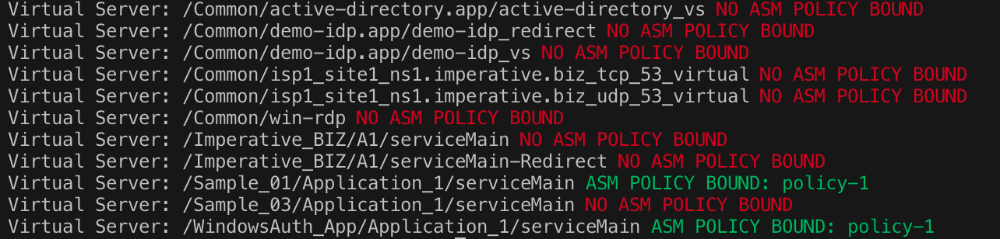

# show-asm-bindings
NodeJS command line app to report ASM status for each virtual server on a BIG-IP. Uses the BIG-IP iControlREST API.

Requires BIG-IP 12.1 or later and NodeJS 6.x



Usage:
```
npm install
node app.js --bigip <big-ip hostname> --username <admin user> --password <password>
```
